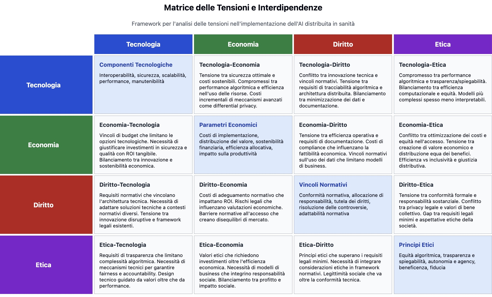

# AI Distribuita e Governance Sanitaria

## Framework Multidimensionale per l'Analisi delle Tensioni tra Norme, Etica e Innovazione

[](https://www.itais.org/conference)
[](https://www.fabioliberti.com/ItAIS2025/index.html)
[](LICENSE)

<div align="center">
  
</div>

Questo repository contiene il sito web interattivo dedicato al **framework multidimensionale [📊](https://www.fabioliberti.com/ItAIS2025/)** per l'analisi dell'AI distribuita in sanità, sviluppato per la XXII *Conference of the Italian Chapter of AIS* (ITAIS 2025).

### 📋 Sommario
- [AI Distribuita e Governance Sanitaria](#ai-distribuita-e-governance-sanitaria)
  - [Framework Multidimensionale per l'Analisi delle Tensioni tra Norme, Etica e Innovazione](#framework-multidimensionale-per-lanalisi-delle-tensioni-tra-norme-etica-e-innovazione)
    - [📋 Sommario](#-sommario)
  - [Panoramica](#panoramica)
  - [Framework Multidimensionale](#framework-multidimensionale)
  - [Limitazioni dello Studio](#limitazioni-dello-studio)
    - [🔬 Limitazioni Principali](#-limitazioni-principali)
    - [🚀 Opportunità di Ricerca Futura](#-opportunità-di-ricerca-futura)
    - [💡 Valore del Contributo](#-valore-del-contributo)
  - [Struttura del Sito](#struttura-del-sito)
  - [Utilizzo Locale](#utilizzo-locale)
  - [Contribuire](#contribuire)
    - [Come contribuire](#come-contribuire)
  - [Conferenza ITAIS 2025](#conferenza-itais-2025)
  - [Autori](#autori)
  - [Citazioni](#citazioni)
    - [Pubblicazioni correlate](#pubblicazioni-correlate)
  - [Licenza](#licenza)

---

## Panoramica
Il progetto **AI Distribuita e Governance Sanitaria** esplora l'intersezione fra le tecnologie di Intelligenza Artificiale distribuita (ad es. *federated learning* ed *edge computing*) e le dimensioni **legali, etiche, organizzative ed economiche** che ne guidano l'adozione nel settore sanitario.  
Attraverso una prospettiva multidisciplinare esaminiamo come l'**AI Act** europeo e i framework normativi emergenti si intreccino con i paradigmi etici consolidati, evidenziando le tensioni che sorgono quando queste tecnologie incontrano le convenzioni socio‑organizzative esistenti.

---

## Framework Multidimensionale
Il framework integra **quattro dimensioni** fondamentali in un modello analitico che mappa le interrelazioni e le tensioni nell'implementazione dell'AI distribuita in sanità:

| Dimensione | Fattori chiave | Esempi |
|------------|---------------|--------|
| **Tecnologica** | Interoperabilità – Sicurezza – Scalabilità – Performance | Federated Learning, Standard HL7 FHIR, cifratura dei dati, orchestrazione edge |
| **Economica** | Costi – Distribuzione del valore – Sostenibilità – Efficienza | Modelli *pay‑per‑use*, analisi costi‑benefici |
| **Giuridica** | GDPR – AI Act – Tutela diritti – Allocazione responsabilità | Conformità data‑protection, requisiti *high‑risk AI* |
| **Etica** | Equità algoritmica – Trasparenza – Autonomia – Beneficenza – Fiducia | Audit dei bias, *explainability*, consenso informato |

La **matrice delle tensioni** mette in evidenza conflitti e sinergie fra queste dimensioni, offrendo uno strumento pratico per navigare la complessità dell'AI distribuita in sanità.

---

## Limitazioni dello Studio

⚠️ **Trasparenza Metodologica**: Nel rispetto dei principi di integrità accademica, riconosciamo le seguenti limitazioni che definiscono i confini di applicabilità del framework e aprono direzioni per future ricerche.

### 🔬 Limitazioni Principali

**Approccio Teorico-Concettuale**  
Il framework è sviluppato attraverso sintesi teorica interdisciplinare e non include validazione empirica quantitativa su implementazioni operative reali, rappresentando una base teorica per future ricerche empiriche.

**Contesto Europeo-Centrico**  
L'analisi si concentra sul framework normativo europeo (GDPR, AI Act), limitando la generalizzabilità a contesti con quadri regolamentari significativamente diversi.

**Settore Sanitario Specifico**  
Il modello è ottimizzato per il dominio sanitario; l'applicazione ad altri settori richiederebbe adattamenti sostanziali non esplorati nel presente studio.

**Natura Qualitativa delle Relazioni**  
Le tensioni tra dimensioni sono rappresentate qualitativamente; lo sviluppo di modelli quantitativi rappresenterebbe un significativo avanzamento metodologico.

### 🚀 Opportunità di Ricerca Futura

- **Validazione Empirica**: Studi longitudinali su implementazioni reali
- **Strumenti Operativi**: Dashboard e metodologie standardizzate di assessment
- **Estensioni Cross-Settoriali**: Adattamento a finanza, trasporti, industria
- **Quantificazione**: Modelli matematici per misurare l'intensità delle tensioni
- **Validazione Cross-Culturale**: Testing in contesti normativi diversi

### 💡 Valore del Contributo

Nonostante queste limitazioni, il framework fornisce:
- **Primo modello multidimensionale integrato** per l'AI distribuita in sanità
- **Mappatura sistematica delle tensioni** tra governance dimensions
- **Base teorica solida** per ricerche empiriche future
- **Roadmap strutturata** per l'advancement del campo

> 📖 **Dettagli Completi**: Per l'analisi approfondita delle limitazioni, consulta il documento [limitations_of_study.md](docs/limitations_of_study.md)

---

<div align="center">
  
  
  
</div>

---

## Struttura del Sito
1. **Home** – Introduzione al progetto e al framework  
2. **Framework** – Visualizzazione interattiva del modello a quattro assi  
3. **Dimensioni** – Approfondimenti su ciascun asse  
4. **Value Management** – Approfondimenti su dimensioni di valore e potenziale trasformativo  
5. **Tensioni** – Matrice interattiva delle tensioni  
6. **Casi di Studio** – Applicazioni pratiche del framework  
7. **Risorse** – Pubblicazioni, strumenti e materiali di riferimento  

---

## Utilizzo Locale
```bash
# Clonare il repository
git clone https://github.com/FABIOLIBERTI/AI-DIGOSA.git
cd AI-DIGOSA

# Aprire il file HTML principale in un browser
# macOS
open index.html
# Linux
xdg-open index.html
# Windows
start index.html
```

---

## Contribuire
Siamo aperti a contributi che arricchiscano il framework o migliorino il sito web, in linea con la track **T11 "Emerging Technologies and Organizational Culture"** di ITAIS 2025.

### Come contribuire
1. **Fork** del repository  
2. Creare un branch dedicato:  
   ```bash
   git checkout -b feature/descrizione‑breve
   ```  
3. Effettuare il commit:  
   ```bash
   git commit -m "Descrizione sintetica della modifica"
   ```  
4. Push al branch remoto:  
   ```bash
   git push origin feature/descrizione‑breve
   ```  
5. Aprire una **Pull Request** su `main`

Tutti i contributi saranno revisionati dai *maintainer* per garantire coerenza con la visione del progetto.

---

## Conferenza ITAIS 2025
Questo progetto è sviluppato per la XXII *Conference of the Italian Chapter of AIS* (ITAIS 2025), **Track T11 – Emerging Technologies and Organizational Culture**, presso LIUC Business University.  
Informazioni aggiornate su programma, registrazione e logistica sono disponibili sul [sito ufficiale della conferenza](https://www.itais.org/conference).

---

## Autori
*Inserire qui le informazioni sulle competenze disciplinari e gli autori del progetto.*

| Dimensione | Nome / Ente | Competenze | Contributo |
|------------|-------------|------------|------------|
| Tecnologica | *Fabio Liberti*, *Universitas Mercatorum* | Federated Learning, Edge Computing, Informatica Sanitaria | Framework tecnologico, analisi sicurezza e scalabilità |
| Tecnologica | *Franco Maciariello*, *Universitas Mercatorum* | Applied AI, Digital transformation, Interoperabilità | Analisi digitalizzazione |
| Tecnologica | *Vittorio Stile*, *Universitas Mercatorum* | Digital transformation, Blockchain, UX Designer | Analisi sicurezza |
| Etica       | *Nunzia Cosimo*, *Universitas Mercatorum* | Etica dell'AI, Bioetica | Analisi bias, autonomia decisionale |
| Economica   | *Fracesco Avolio*, *Universitas Mercatorum* | Value Management, Economia Sanitaria | Analisi costi‑benefici, modelli di sostenibilità |
| Giuridica   | *Alfonso Laudonia e Vito Cicoira*, *Universitas Mercatorum* | Diritto AI, GDPR, Normativa Sanitaria | Analisi quadro normativo, compliance |

---

## Citazioni
Se utilizzi questo framework o i materiali in questo repository, cita:

> [Autori]. (2025). *AI Distribuita e Governance Sanitaria: Un'Analisi Multidimensionale delle Tensioni tra Norme, Etica e Innovazione.* In *Proceedings of the XXII Conference of the Italian Chapter of AIS*, LIUC Business University, Track T11.

### Pubblicazioni correlate
- Di Vaio, A., Palladino, R., Hassan, R., & Escobar, O. (2020). *Artificial intelligence and business models in the sustainable development goals perspective: A systematic literature review.* Journal of Business Research, **121**, 283‑314.  
- Martin, K. (2019). *Ethical Implications and Accountability of Algorithms.* Journal of Business Ethics, **160**, 835‑850.  
- Kairouz, P., McMahan, H. B., Avent, B., *et al.* (2021). *Advances and open problems in federated learning.* Foundations and Trends® in Machine Learning, **14**(1‑2), 1‑210.  
- Floridi, L., & Cowls, J. (2019). *A unified framework of five principles for AI in society.* Harvard Data Science Review, **1**(1).  
- Buhmann, A., & Fieseler, C. (2023). *Deep Learning Meets Deep Democracy: Deliberative Governance and Responsible Innovation in Artificial Intelligence.* Business Ethics Quarterly, **33**(1), 146‑179.  

---

## Licenza
Questo progetto è distribuito con licenza **Mercatorum**.  
La licenza Mercatorum consente uso commerciale e non commerciale, modifica, distribuzione e opere derivate, a condizione di mantenere l'avviso di copyright e di licenza nelle copie sostanziali del software.

© 2025 *AI Distribuita e Governance Sanitaria* – Rilasciato sotto [Mercatorum](LICENSE).